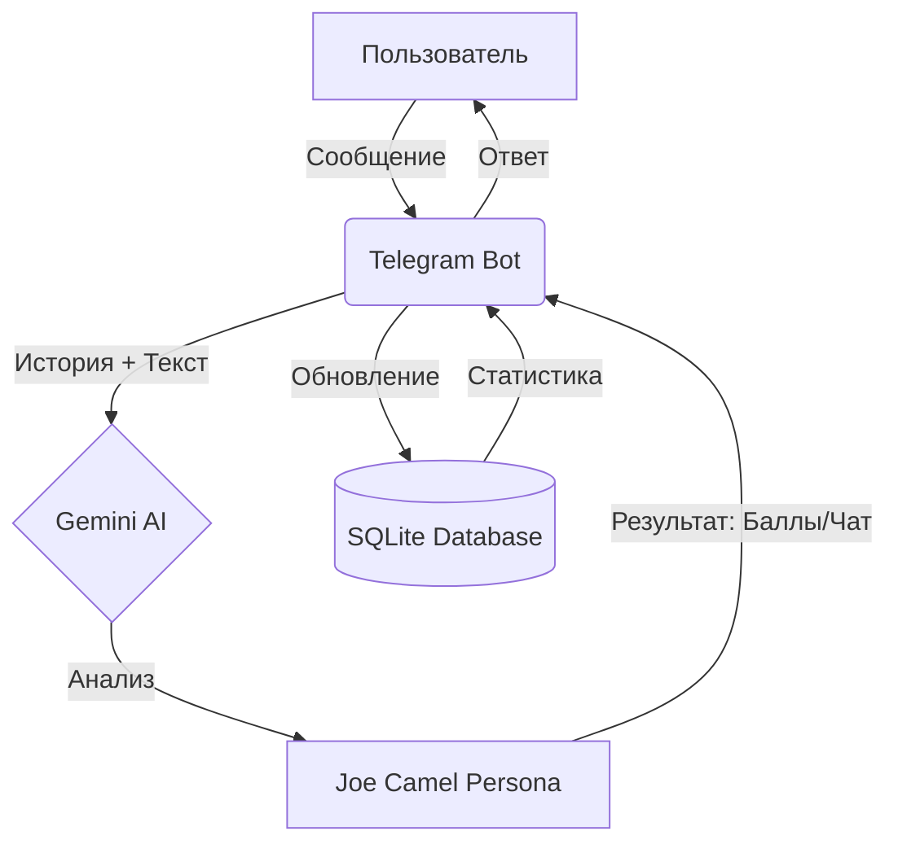

# JoeCamelBot

[](https://www.python.org/downloads/)
[](https://docs.aiogram.dev/)
[](https://www.docker.com/)
[](https://opensource.org/licenses/MIT)


JoeCamelBot — это Телеграм-бот, предназначенный для отслеживания и оценки активности пользователей в групповых чатах. Бот использует Google Gemini AI для анализа сообщений, начисления баллов и ведения рейтинга на основе системы "База против Анти".

## Архитектура работы



## Основные компоненты

- **main.py**: Логика бота, обработчики событий (aiogram) и планировщик задач (apscheduler).
- **database.py**: Асинхронное управление базой данных SQLite (aiosqlite).
- **ai_logic.py**: Интеграция с Google Gemini API и логика формирования ответов.
- **Dockerfile**: Контейнеризация и оркестрация для развертывания.

## Функциональные возможности

- **AI-оценка**: Автоматический анализ сообщений и начисление баллов (Мини, Средняя, Большая, Экстра, Мега).
- **Персонаж**: Ответы в стиле Джо Кэмела — циничного философа из рекламы 90-х.
- **Диспуты**: Возможность оспорить вердикт бота через систему социального голосования.
- **Ежедневные штрафы**: Автоматическое списание баллов за отсутствие активности.
- **Аудиты**: Периодические саммари последних событий в чате.


## Требования

- Python 3.11 или выше.
- Docker и Docker Compose.
- Токен Телеграм-бота (obtained from @BotFather).
- Ключ Google Gemini API.

## Установка и запуск

1. Клонируйте репозиторий:
   ```bash
   git clone https://github.com/divohub/JoeCamelBot.git
   ```

2. Создайте файл `.env` в корневой директории:
   ```env
   TELEGRAM_BOT_TOKEN=ваш_токен
   GEMINI_API_KEY=ваш_ключ
   ADMIN_CHAT_ID=id_администратора
   DB_PATH=data/shnyaga.db
   ```

3. Запустите приложение:
   ```bash
   docker-compose up -d --build
   ```


## Список команд

- `/start`: Инициализация профиля пользователя.
- `/help`: Просмотр правил и доступных команд.
- `/top`: Список лидеров чата по баллам силы.
- `/stats`: Просмотр личной статистики с пагинацией.
- `/setchat`: Настройка текущего чата как основной арены.
